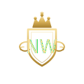

# Example / Demo Images — CompanyCard

> **מדיניות:** אלו תמונות הדוגמה המאושרות **היחידות** לשימוש כדוגמאות במוצר.
> אין להשתמש בתמונות דמו אחרות. All demo/example imagery in the product must use ONLY the approved images below.
>
> נוצר: 9 יולי 2026

---

## לקוח הדוגמה: Northwind Luxury Real Estate

עמוד "CompanyCard for Teams" (`business.html`) מדגים חברת לקוח אחת — **Northwind Luxury Real Estate** — עם צוות של 6 אנשים על אותו מותג.

### לוגו הלקוח

| תצוגה | תיאור | קובץ יעד |
|---|---|---|
|  | לוגו זהב — מגן + כתר, "NORTHWIND / Luxury Real Estate" | `assets/team/northwind-logo.svg` |

### 6 חברי הצוות (headshots ריאליסטיים)

מופיעים ב־brand wall (6 כרטיסים), ו־Rachel/Diego/Amara גם ב־Team directory.

| # | תצוגה | שם | תפקיד בכרטיס | קובץ יעד |
|---|---|---|---|---|
| 1 |  | Rachel Kim   | VP Sales            | `assets/team/photos/rachel.jpg` |
| 2 |   | Diego Martín | Account Executive   | `assets/team/photos/diego.jpg`  |
| 3 |   | Amara Okafor | Partnerships Lead   | `assets/team/photos/amara.jpg`  |
| 4 |  | Marcus Bell  | Solutions Engineer  | `assets/team/photos/marcus.jpg` |
| 5 |   | Sofia Costa  | Customer Success    | `assets/team/photos/sofia.jpg`  |
| 6 |     | Tom Walsh    | Marketing Manager   | `assets/team/photos/tom.jpg`    |

---

## איך זה מחובר בקוד

- ב־`business.html` כל תמונת פרופיל מצביעה על `assets/team/photos/<name>.jpg`.
- אם הקובץ עדיין לא הועלה, יש **נפילה אוטומטית** (`onerror`) חזרה לאווטאר ה־SVG הזמני
  (`assets/team/<name>.svg`) — כך שאף פעם אין "תמונה שבורה".
- ברגע שמעלים את קבצי ה־`.jpg` לתיקייה `assets/team/photos/`, התמונות האמיתיות מופיעות אוטומטית.

## מה צריך לעשות (חד־פעמי)

1. לשמור את 6 ה־headshots בשמות המדויקים שלמעלה בתוך `assets/team/photos/`.
2. לשמור את לוגו Northwind בתור `assets/team/northwind-logo.svg`.
3. `git add -A && git commit && git push` → Netlify מפרסם אוטומטית.

> **פורמט:** `.jpg` לתמונות פרופיל, `.svg` ללוגו (וקטורי — חד בכל גודל). התמונות והלוגו כבר נשמרו בפרויקט ומחוברים ל־`business.html`.

---

## תמונות reference (לא נכנסות ישירות לאתר)

- שלושת תמונות ה־"badge" (Sofia / Marcus / Tom מחזיקים תג Northwind) — רפרנס לסגנון בלבד.
- הכרטיסים המעוצבים ברקע הסגול — מוקאפ להמחשה, לא asset באתר.
- הלוגו של Northwind משמש **רק כדוגמת לקוח** — הוא אינו הלוגו של CompanyCard.
